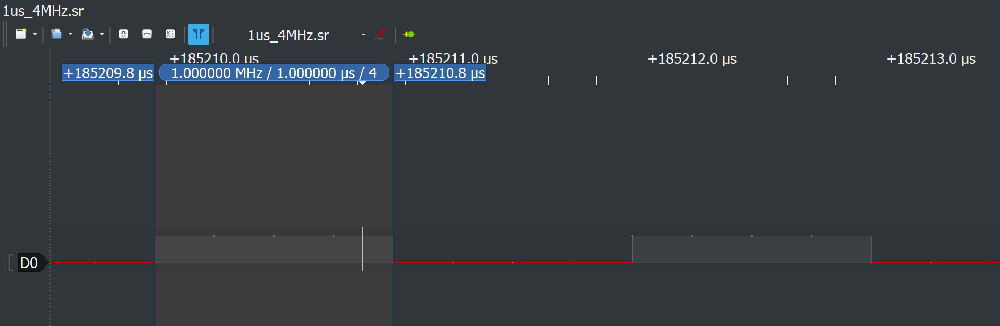

# Hard Microsleep Library Via System Timer for the Raspberry Pi
pi_microsleep_hard.c provides a hard microsleep function for the Raspberry Pi via the system timer peripheral. microsleep_hard() offer delays down to 1 microsecond with precision of TBD microseconds. This software requires no dependencies other than Raspbian running on any version of the Raspberry Pi.

This project is meant to provides a hard sleep function for projects that require a software-defined delay ranging from 1 to 100 microseconds. The standard delay call nanosleep(), despite allowing you to define very precise sleep durations, will typically sleep longer than desired (on the order of 10s to 100 or more microseconds) due to operating system overhead. It is a system call after all. microsleep_hard() is mean to fill in this gap by offering callers a very precise delay function for those times when even 1 microsecond matters.

microsleep_hard() should be used for delay ranging from 1 to 100 microseconds. In all other cases, nanosleep() is recommended as microsleep_hard() does not pause thread execution but instead enters into a busy wait to ensure timing requirements are met.



pi_microsleep_hard.c is provided two ways for flexibility:
1. C source and header files that can be compiled along with your program
2. C shared library

To learn and understand the source code, see [Documentation](#Documentation) for an understanding of how this works and some timing statistics I have generated.

## Getting Started

These instructions will get you a copy of the project up and running on your local machine for development and testing purposes.

### Installing

#### Obtain the Project

First, clone this repository.

```
$ git clone https://github.com/besp9510/pi_microsleep_hard.git
```

Alternatively, download the repository from Git.

#### Configure

Once obtaining a copy on your local machine, navigate to the top directory and run the configure script to generate a Makefile.

```
$ ./configure
```

By default, files will be installed under `/usr/local/`. Note that passing the option ``--help`` will display available configuration options such as installation directory prefix and debug symbols.

#### Make

Compile pi_microsleep_hard.c into a shared library.

```
$ make
```

Then install files to the installation directory. You must run the following either as root or with root privileges.

```
$ sudo make install
```

#### Uninstall
At anytime, to uninstall pi_microsleep_hard.c, use the same Makefile used for compiling or a Makefile generated using the configuration script with the same options as root or with root privileges.

```
$ sudo make uninstall
```

## Running the Test

test_pi_microsleep_hard.c is a test script to check and see the hard microsleep function working on your Pi. The outline of the test is:
1. Setting up microsleep_hard()
2. Defining two delay times (slow & fast)
3. Defining a GPIO pin to toggle (to be read by a signal analyzer or blink an LED)
4. Completing a slow and fast clock pulse loop
    * Toggle the GPIO pin according to slow and fast delay times for 1 second

### Prerequisites

The test script uses [pi_lw_gpio.c](https://github.com/besp9510/pi_lw_gpio) (another Pi library that I authored) to manipulate the Pi's GPIO pins. Ensure this library is installed on your Pi prior to attempting to compiling the test script.

### Installing

To compile the test script, first navigate to the test directory `test/`. Next, run the configure script to generate the Makefile:

```
$ ./configure
```

By default, the pi_microsleep_hard.c shared library will be looked for under the standard directories (e.g. `/usr/local/`). If this is not the case, pass the option ``--help`` to learn how to specify a directory to be searched. Additionally, ``--help`` will also display available configuration options such as debug symbols and debug logs.

Next, compile the test script:

```
$ make
```

This will create an executable called `test_pi_microsleep_hard` under `bin/`.

## Documentation

### How it Works

pi_microsleep_hard.c works by using the system timer peripheral. From the BCM peripheral user guide:

> The System Timer peripheral provides four 32-bit timer channels and a single 64-bit free running
> counter. Each channel has an output compare register, which is compared against the 32 least
> significant bits of the free running counter values. When the two values match, the system timer
> peripheral generates a signal to indicate a match for the appropriate channel. The match signal is then
> fed into the interrupt controller. The interrupt service routine then reads the output compare register
> and adds the appropriate offset for the next timer tick. The free running counter is driven by the timer
> clock and stopped whenever the processor is stopped in debug mode.


In short, the system timer is a free running timer that increments a 64 bit counter every microsecond. The intended way to use the system timer is by way of compare registers. The four total compare registers holds the value to be compared to the lower 32 bits of the timer. If any compare register matches the timer, an IRQ which sets a corresponding bit in the system timer control/status register that can be polled. Typically, compare registers 1 & 3 are unused by the operating system or GPU.

My implementation of `microsleep_hard()` does not use these compare registers however. Instead, I continually compare against the lower 32-bits of the timer myself and determine when the desired sleep time has elapsed. I found that sleep durations between 1 and 13 microseconds saw unreliable interrupt generation (leading to an infinite loop) when using the compare registers as the BCM peripheral guide describes.

See my code block below to understand the two different implementations.

```c
// Between 1 and 13 usec delay, interrupt is not generated by the system
// timer reliably and we must rely on comparing the free running counter
// ourselves. I would guess this is a limitation of Linux scheduler and
// its interrupt sharing.
if (usec < 13) {
    // Add to current value of the timer to find what our timeout time will be
    timout = sys_timer_reg->clo + usec;

    // Spin while we wait for the timer to tick:
    while (sys_timer_reg->clo < timout);
} else {
    // This will clear the interrupt pending bit for C3 specifically:
    sys_timer_reg->cs = 0x8;

    // Set the compare time to current timer + desired sleep:
    sys_timer_reg->c3 = sys_timer_reg->clo + usec;

    // Spin while interrupt pending bit is cleared; it will be set once the
    // timer elapses:
    while (((sys_timer_reg->cs & 0x8) >> 3) == 0);
}
```

I choose the "brute force" polling method instead of relying on interrupt generation by the system timer. Choosing one method over having an if statement choosing between two was one optimization I implemented to minimize overhead to meet the most strict timing requirements possible.

#### Timing statisitcs

I calculated timing statistics by running the test script at 1 and 2 us delays.


### Functions

#### Setup Microsleep Hard
Setup microsleep hard prior to the first call of `microsleep_hard()`. **An explicit call to setup microsleep hard is not required but recommended**. If not explicitly called, expect only the _first_ function call of `microsleep_hard()` to have additional overhead and may not meet advertised sleep precision and overall timing capabilities.

```c
int setup_microsleep_hard(void);
```

##### Return Value
`setup_microsleep_hard()` returns 0 upon success. On error, an error number is returned.

Error numbers:
* `ENOPIVER` : Could not get Pi board revision.
* `MAP_FAILED` : Memory map failed (most likely due to permissions)

#### Microsleep Hard
Sleep for a desired amount of time in microseconds.

```c
int microsleep_hard(unsigned int usec);
```

##### Return Value
`microsleep_hard()` only returns `0`.

## Contributing
Follow the "fork-and-pull" Git workflow.
1. Fork the repo on GitHub
2. Clone the project to your own machine
3. Commit changes to your own branch
4. Push your work back up to your fork
5. Submit a Pull request so that your changes can be reviewed

Be sure to merge the latest from "upstream" before making a pull request!

Feel free to email at the email address under my account name if you have any questions.
## Authors

Benjamin Spencer

## License

This project is licensed under the MIT License - see the [LICENSE.md](LICENSE.md) file for details
